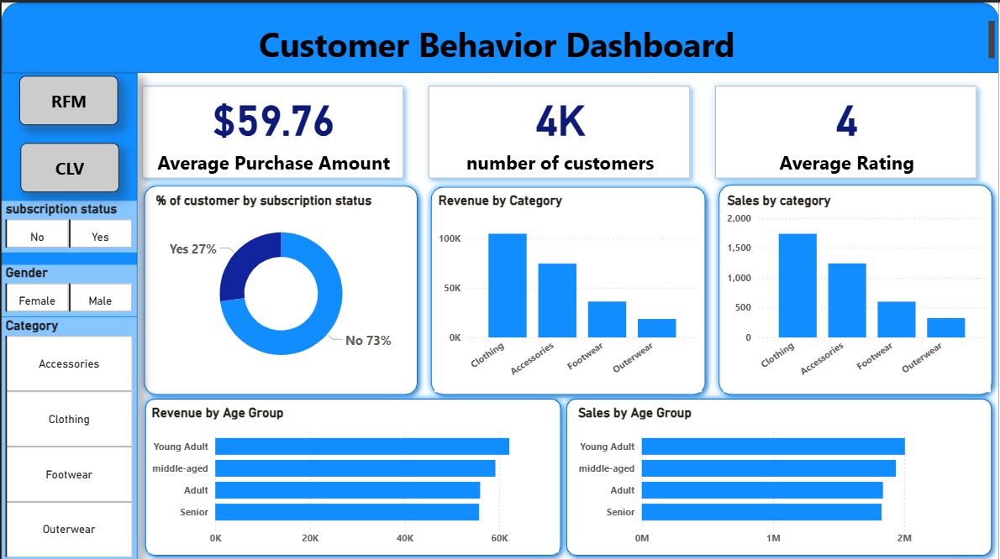
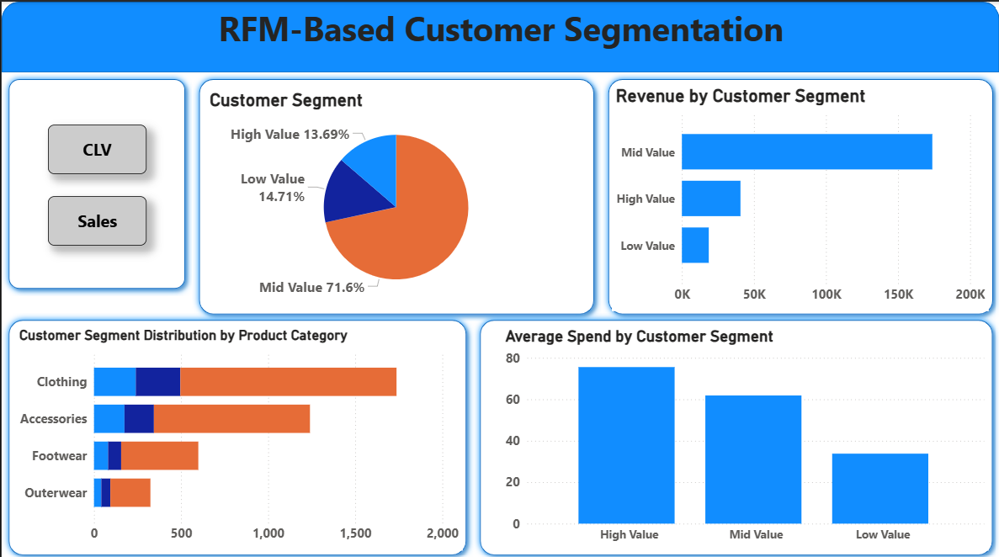
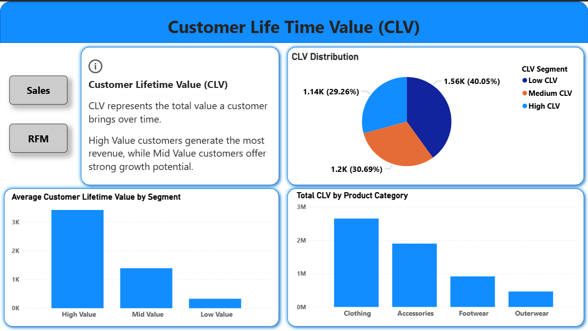

# Customer Behavior Analysis Dashboard

## Project Overview

This project analyzes retail customer shopping behavior using Python, SQL, PostgreSQL, and Power BI.

The main goal of the project is to identify customer purchasing trends, perform customer segmentation using RFM Analysis, and evaluate Customer Lifetime Value (CLV) to help businesses improve customer engagement, marketing strategies, and long-term revenue growth.

---

# Problem Statement

A retail company wanted to better understand customer shopping behavior in order to improve:
- Sales performance
- Customer satisfaction
- Long-term customer loyalty

The business aimed to identify:
- Which customers generate the highest revenue
- Which product categories perform best
- How customer demographics affect purchasing behavior
- Opportunities to improve retention and repeat purchases

# Business Solution

Using RFM Segmentation and Customer Lifetime Value (CLV) Analysis, this project helped identify profitable customer groups, purchasing trends, and retention opportunities.

The analysis supports business decision-making by:

- Identifying High Value customers for targeted marketing campaigns
- Improving customer retention using loyalty and subscription strategies
- Increasing revenue through personalized product recommendations
- Understanding category-wise customer behavior and spending patterns
- Helping businesses focus on high-performing product categories like Clothing
- Supporting long-term growth through customer lifetime value analysis

These insights can help businesses optimize marketing spend, improve customer engagement, and maximize long-term profitability.
---

# Tools & Technologies Used

- Python (Pandas)
- SQL
- PostgreSQL
- Power BI
- DAX

---

# Project Workflow

## 1. Data Cleaning & Preprocessing (Python)
- Loaded and cleaned customer shopping dataset
- Removed redundant columns
- Created age groups
- Converted purchase frequency into numerical values
- Prepared data for SQL and Power BI analysis

---

## 2. SQL Analysis (PostgreSQL)
Performed business-focused SQL analysis including:
- Revenue analysis by category
- Customer purchase behavior
- Subscription analysis
- Shipping preference analysis
- Top-performing products
- Customer segmentation queries

---

## 3. Power BI Dashboard Development

Created interactive dashboards for:
- Customer KPIs
- Revenue & Sales Analysis
- RFM Customer Segmentation
- Customer Lifetime Value (CLV) Analysis

---

# Key Insights

- Analyzed 3,900+ customers
- Average Purchase Amount: $59.76
- Average Customer Rating: 4/5
- 71.6% customers belong to the Mid Value segment
- High Value customers generated the highest revenue
- Clothing category contributed nearly 2.7M in total CLV
- 73% customers are non-subscribers, revealing strong loyalty program opportunities

---

# RFM Segmentation

Customers were segmented using:

## Recency
How recently a customer purchased

## Frequency
How often a customer purchased

## Monetary
How much a customer spent

Customers were classified into:
- High Value Customers
- Mid Value Customers
- Low Value Customers

This helped identify the most profitable customer groups.

---

# Customer Lifetime Value (CLV)

CLV analysis was performed to estimate long-term customer value and identify:
- Customers with the highest profitability
- Categories generating maximum lifetime revenue
- Opportunities for customer retention and loyalty strategies

---

# Dashboards

## 1. Sales & KPI Dashboard

- Revenue analysis
- Sales by category
- Revenue by age group
- Subscription analysis

### Dashboard Preview



---

## 2. RFM Customer Segmentation Dashboard

- Customer segmentation distribution
- Revenue by customer segment
- Average spend by segment

### Dashboard Preview



---

## 3. Customer Lifetime Value (CLV) Dashboard

- CLV distribution
- Average CLV by segment
- Total CLV by category

### Dashboard Preview



---

# Business Recommendations

- Focus marketing campaigns on High Value customers
- Introduce loyalty/subscription programs for non-subscribers
- Increase investment in high-performing categories like Clothing
- Use customer segmentation for personalized marketing
- Improve retention strategies using CLV insights

---

# Repository Structure

```bash
├── notebooks/
├── sql/
├── dashboards/
├── image/
│   ├── sales.png
│   ├── rfm.png
│   └── clv.png
└── README.md
```

---

# Author

Sheik Faresh Ahamad

Aspiring Data Analyst passionate about transforming raw data into actionable business insights using SQL, Python, and Power BI.
